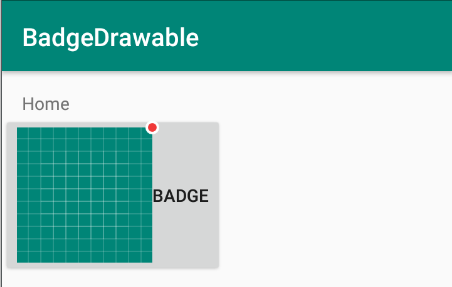

BadgeDrawable
====

对布局零入侵的高效小红点实现方案。



```kotlin
    // 使用原图标 icon 和小红点 badge 创建BadgeDrawable。 badge 可以从xml中定义，也可以是其他自定义的 Drawable 对象。
    val badgeDrawable = BadgeDrawable(icon, badge)
    // 设置 badgeDrawable
    toggle_badge.setCompoundDrawablesWithIntrinsicBounds(badgeDrawable, null, null, null)
    toggle_badge.setOnClickListener {
        // 显示或隐藏小红点
        badgeDrawable.showBadge = !badgeDrawable.showBadge
    }
```